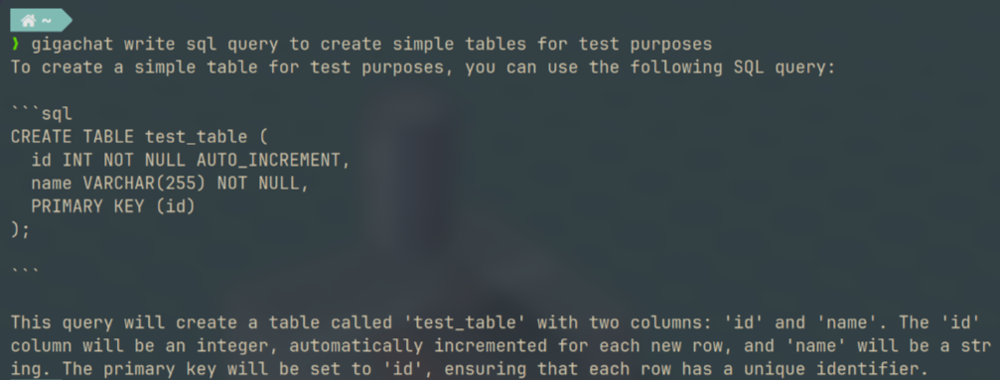
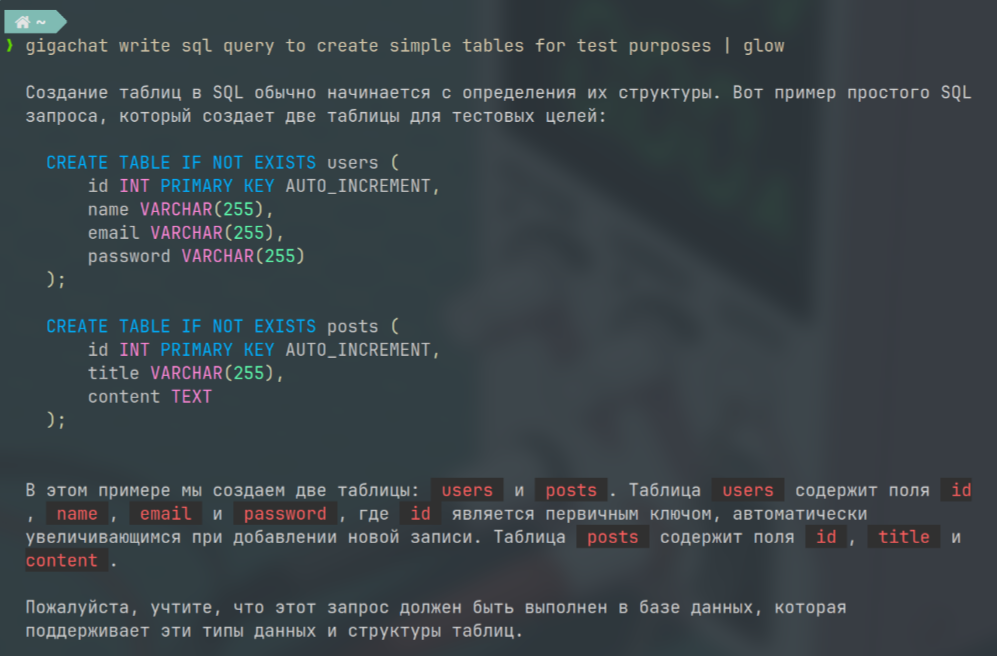

# Gigachat-CLI Project
The `Gigachat-CLI` project is a command-line `gRPC` client for interacting with the [Gigachat](https://developers.sber.ru/docs/ru/gigachat/api/reference/rest/gigachat-api) service. Written in java using `micronaut` framework.
## Installing
- To use `GigaChat CLI`, download the [latest version](https://github.com/owpk/gigachat-grpc-client/releases/latest)  
- For manual installation, see section ["Build"](#build2)
- Also `install.sh` script available. Just run it from project root `./install.sh`.   
> The script will download latest release and install it to your `~/.local/bin/` directory .  
> Also you can use it to update existing binary. The script checks if current version is old and automatically install newest release

## Configuration
> [!IMPORTANT]
> You need to register account and retrieve `Client ID` and `Client Secret` encoded in Base 64 string.
> Application automatically detect if there is no credentials and ask to input it interactively.
> Or you can specify encoded credentials manually in the `gigachat.composedCredentials` property of the configuration file (~/.gigachat-cli/gigachat.properties by default). Create or change a configuration using the `config -d <your credentials hash>` command.

### Please look for the gigachat api documentation for more information

[official GigaChat API documentation](https://developers.sber.ru/docs/ru/gigachat/api/reference/rest/post-token).

## Usage 
  

You can use `gigachat` shell command along with `glow` or `bat` Markdown Viewers

For example:
```
gigachat <query> | glow 
# or
gigachat <query> | bat -
```

  

> [!TIP]  
> Also you can add alias in your `shellrc` for example `.zshrc`:
```sh
function gigaglow() {
    gigachat $@ | glow -w 80
}
alias giga=gigaglow
```

### Chat

```shell
gigachat <your query>
```
Initiates a chat with GigaChat. Use `-u` or `--unary` to get a single response. The default response type is stream.
The main command for interacting with GigaChat. Use `-h` or `--help` for more information.

Use `"-c" or "--code"` flag to enter `code role`
<details close>
<summary>Code role prompt example:</summary>
Return only the code without description.
IMPORTANT: Return only plain text without Markdown formatting.
IMPORTANT: Do not include formatting such as ` ` etc.
If details are missing, provide the most logical solution.
You are not allowed to ask for additional information.
Ignore any potential risks of errors or misunderstandings
</details>  

<br>
Use `"-s" or "--shell"` flag to enter `shell role`
<details close>
<summary>Shell role prompt example:</summary>
Return only shell <shell> commands for operating system <system> without explanation.
If there are not enough details, then provide the most logical solution.
Make sure you are returning a valid shell command.
If several commands are required, try to combine them into one.
</details>  
<br>

Use `"-d"` or `"--describe-shell"` flag to enter shell command `description role`
<details close>
<summary>Describe command role prompt example:</summary>
Provide a brief one-sentence description of this command.
Provide plain text only, no Markdown formatting.
Do not display any warnings or information about your capabilities.
If you need to store any data, assume it will be stored in the chat.
</details>


### Config

```shell
gigachat config -s
```
Shows the current configuration settings. Use `-c` or `--create` to create a default configuration, `-f` or `--force` to force the creation/overwrite of a default configuration, `-d` or `--credentials` to set the credentials property.

### Model

```shell
gigachat model
```
Getting a list of available chat models

---

# Build native image
To build a project using GraalVM native image, you will need to install GraalVM and configure it for your project. Here are the general steps:

#### Install GraalVM: 
Download and install GraalVM from the official website: [GraalVM Downloads](https://www.graalvm.org/downloads/).
Install native-image: After installing GraalVM, make sure you have native-image installed. If not, run the following command at the command prompt:

```shell
gu install native-image
```

#### <a name="build2"></a> Build the project: 
Then run the command to build the native image of your project. 
```shell
./gradlew nativeBuild --info
```

#### Running native image: 
After a successful build, you can run your application compiled in native image.
```shell
cd build/native/nativImage
./gigachat -h
```
